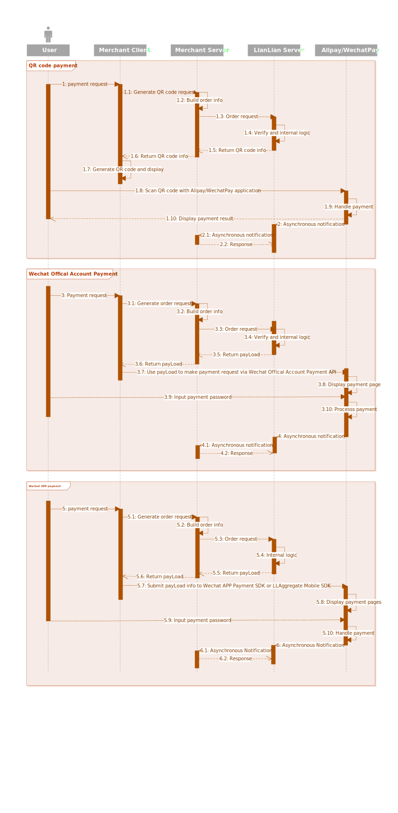

# Aggregate Payment Direct API

This API supports Alipay and WechatPay only. Refer to [Easy Payment](easypay.md) or [Aggregate Payment Redirect API](aggregate_redirect.md) if you are looking for card payments.

Currently it supports following payment methods:

* Alipay/WechatPay QR code payment on PC websites.

* WechatPay official account payment.

* WechatPay app payment.

***

## Request and Response

###### Endpoint

```html
https://wallet.lianlianpay.com/llwalletapi/combinepay.htm
```

###### Request Parameter

|Name|Required|Type|Description|
|:---|:---|:---|:---|
|no_order|Required|String(32)|Merchant order No.|
|oid_partner|Required|String(18)|The unique identification assigned to the merchant. E.g. 201304121000001004|
|appid|Optional|String|Required for Wechat/Alipay App payment or Wechat official account payment. This field is provided by Alipay or WechatPay|
|openid|Optional|String|Required for Wechat official account payment. See [how to obtain openid](https://pay.weixin.qq.com/wiki/doc/api/jsapi.php?chapter=4_4)|
|busi_partner|Required|String(6)|Fixed value. Virtual products, ```101001```; Physical products, ```109001```|
|money_order|Required|String(12)|Merchant order amount, range: 0.01 ~ 100,000,000.00, 2 decimal places are expected, in CNY|
|user_id|Required|String(32)|The unique identification assigned to the user in the merchant’s system|
|name_user|Optional|String| The real name of payer. This param can be skipped to make an anonymous user|
|id_type|Optional|String(1)| 0, ID card <br> 2, Passport <br> 3, Military Officer Certificate <br> 4, Hong Kong-Macau laissez-passer <br> 6, Mainland travel permit for Taiwan residents <br> 9, Police Officer card <br> X, other certificates |
|id_no|Optional|String| Only ID card is supported, the length need to be either 15 or 18. Required for Verified Payment|
|col_userid|Optional|String| Set the recipient as user. This parameter is for E-wallet user only, skip this param if you are not using it. ```col_userid``` can NOT be present with ```col_oidpartner``` in one request|
|col_oidpartner|Optional|String(18)|Set the recipient as relevant ```oid_partner```. ```col_oidpartner``` can NOT be present with ```col_userid``` in one request|
|name_goods|Required|String(40)|Product name. E.g. Pen|
|dt_order|Required|String(14)|Merchant order date. Format: YYYYMMDDHHMMSS, E.g. 20170801225714|
|notify_url|Required|String(128)|Online url where asynchronous notification should be sent, E.g. http://www.lianlianpay.com/help/notify|
|return_url|Optional|String(128)|Online url, your customer will be redirected to ```url_return``` once they finished their payment|
|info_order|Optional|String(255)|```info_order``` will be sent back in synchronous or asynchronous notification for parameters transmission|
|pay_type|Required|String| I, WechatPay QR code payment <br> L, Alipay QR code payment <br> Y, WechatPay APP payment <br> W, WechatPay official account payment|
|risk_item|Required|String| This parameter is used for payment risk control, all required parameters should be included in the value of ```risk_item``` in json format, refer to [Payment Risk](payment_risk_item.md)| 
|shareing_data|Optional|String(1024)| Refer to [Sharing data introduction](aggregate_redirect.md#sharing-data-introduction) |
|sign_type|Required|String(3)|RSA |
|sign|Required|String|Signature value|

###### Response Parameter

|Name|Required|Type|Description|
|:---|:---|:---|:---|
|oid_paybill|Optional|String(18)|Unique transaction No. in LianLian system. E.g. 2011030900001098|
|no_order|Optional|String(32)|Merchant order No.|
|user_id|Required|String(32)|The unique identification assigned to the user in the merchant’s system|
|money_order|Optional|String(12)|Merchant order amount, range: 0.01 ~ 100,000,000.00, 2 decimal places are expected, in CNY|
|oid_partner|Required|String(18)|The unique identification assigned to the merchant. E.g. 201304121000001004|
|payLoad|Optional|String| For QR code payments, a link of QR code is returned <br> For WechatPay APP payment, a json object which is used for requesting Wechat mobile SDK later on is returned <br> For WechatPay official account payment, a json object which is used for requesting relevant API is returned |
|info_order|Optional|String(255)|```info_order``` will be sent back in synchronous or asynchronous notification for parameters transmission|
|pay_type|Required|String| I, WechatPay QR code payment <br> L, Alipay QR code payment <br> Y, WechatPay APP payment <br> W, WechatPay official account payment|
|ret_code|Required|String(4)|0000, Refer to [return codes](return_code.md)|
|ret_msg|Required|String(100)|交易成功|
|sign_type|Required|String(3)|RSA |
|sign|Required|String|Signature value|

***

## Flow

