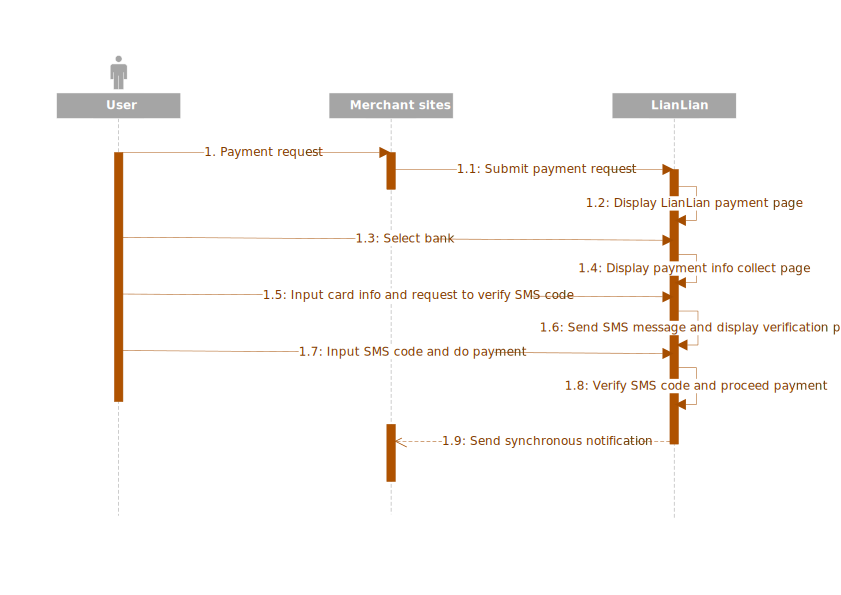
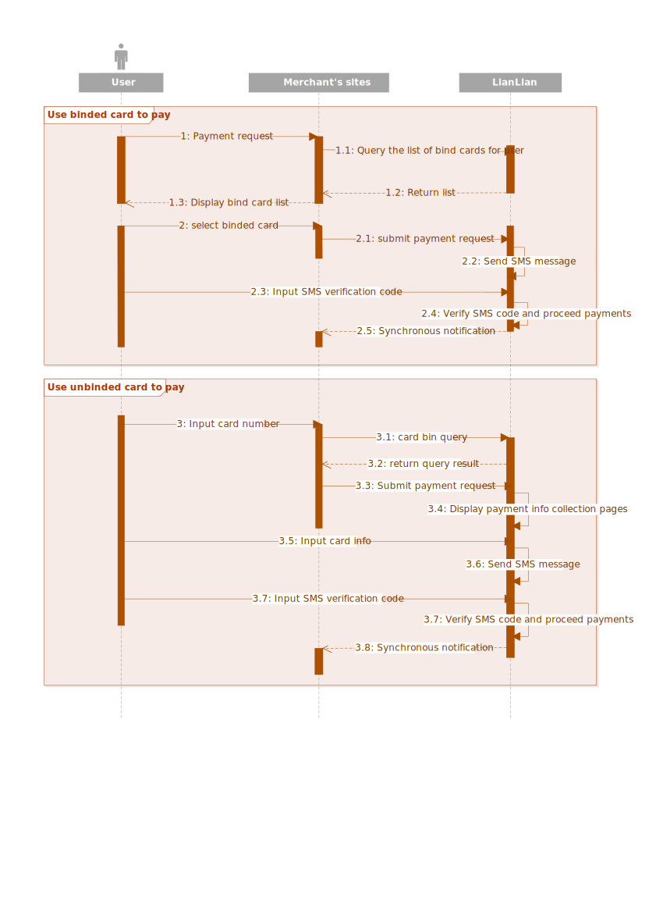

# Easy Payment

Easy Payment is a pure card payment solution for domestic cards in China mainland. We currently support almost all types of the cards from different issuers.

Before you start, the concept of card binding is required to be understood.

***

## What is card binding?

Card binding is generally a step which setup a connection between your customer's card with LianLian by verifying below key payment information:

* Real name. The name of card holders.
* ID number. The ID card number of card holders.
* Phone number. The saved phone number on bank side.
* Card number.

> For credit card, expiration date and CVV/CVC code are additionally required.

These elements are typically collected via pages hosted by LianLian and would be sent to banks to complete verification. A SMS code verification step takes place for verifying user's phone number during the whole process.

Once the verification is done, a special parameter named ```no_agree``` is generated. ```No_agree``` represents all the key payment information mentioned above and can be used in payment request directly. You may use [card bind query API](card_bind_list_query.md) to build your own page to display users' binding card list.

> [Card unbind API](card_unbind.md) is available to remove ```no_agree``` if needed.

***

## Flows

There are 2 ways to integrate Easy Payment into your application, the flows are slightly different.

* [Standard](#standard), redirect your users to LianLian pages directly, you do NOT touch payment sensitive data.

* [Payment info preset](#payment-info-preset), payment sensitive data (```card_no```, ```acct_name```, ```id_no```) is collected in your own page and submitted to LianLian while performing payment requests.

###### Standard



###### Payment info preset

